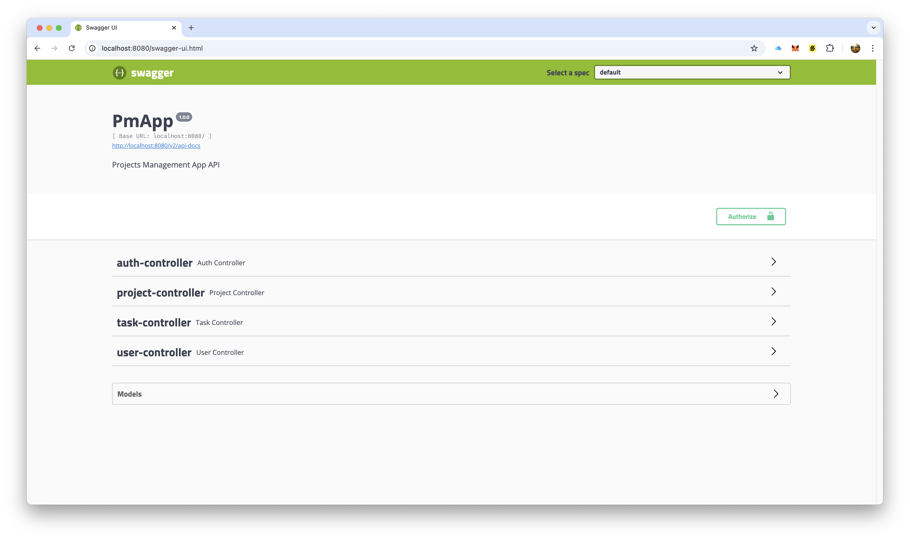
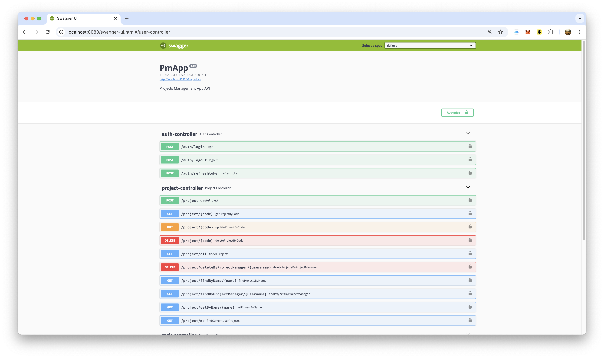
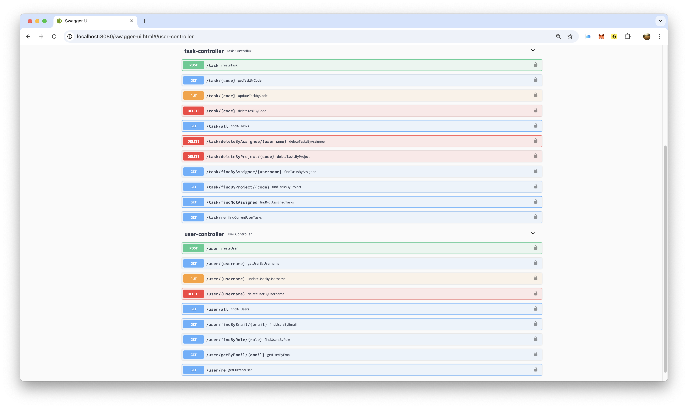
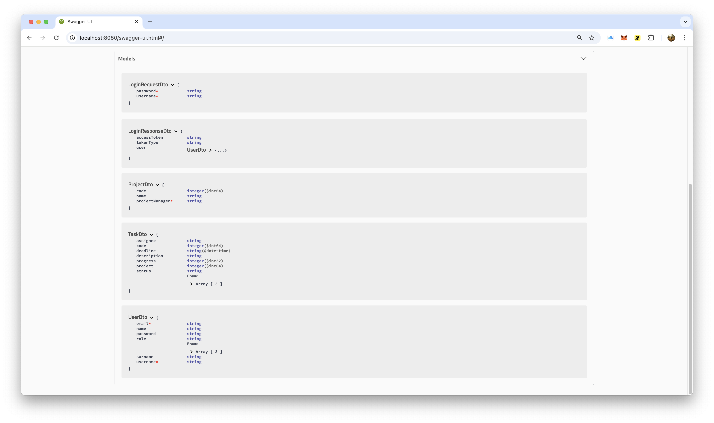

# Projects Management App

Projects Management App is a lightweight and modular tool built with modern technologies like **Java** and **React**, designed to simplify and enhance the management of Projects, Tasks, and Users.

## Table of Contents

1. [Project Overview](#project-overview)
2. [Features](#features)
3. [Screenshots](#screenshots)
4. [Environment Setup](#environment-setup)
   - [Prerequisites](#prerequisites)
   - [Clone the Repository](#clone-the-repository)
   - [Setup Steps](#setup-steps)
5. [Usage](#usage)
   - [How to Run](#how-to-run)
   - [Testing](#testing)
   - [Accessing the Database](#accessing-the-database)
6. [Development](#development)
   - [Improvements](#improvements)
7. [Support](#support)
8. [License](#license)

## Project Overview

The **Projects Management App** is a full-stack application featuring a **React** front-end and a **Java Spring Boot** back-end. It offers secure user authentication via **JWT tokens** and stateless server sessions, robust RESTful APIs secured with **RBAC (Role-Based Access Control)**, and an intuitive interface for managing projects efficiently. Fully containerized with **Docker**, the app includes **Swagger API documentation** and is designed with scalability and extensibility in mind.

Originally developed as a technical demonstrator for a tech interview, it highlights the application of modern technologies and best practices in software design and development.

## Features

- **Authentication**: Secure user authentication using JWT tokens.
- **RBAC**: Role-based access control for API endpoints.
- **Project Management**: Manage Projects, Tasks, and Users seamlessly.
- **RESTful APIs**: Exposes APIs for integration and testing.
- **Swagger Documentation**: Auto-generated API documentation for easy exploration.
- **Dockerized**: Fully containerized with Docker for simplified deployment.
- **Token Rotation**: Automatic token refresh for uninterrupted user sessions.

## Screenshots

Here are some screenshots of the Projects Management App in action:

### Application


### API

<p align="center">
  
  
</p>
<p align="center">
  
  
</p>

## Environment Setup

### Prerequisites

To successfully use or test this application, ensure you have the following software installed:

- [Java](https://www.java.com/en/download/) - Version 8 or higher
- [Node.js](https://nodejs.org/it/download/) - LTS version
- [Yarn](https://yarnpkg.com/lang/en/docs/install/) - Recommended (the scripts, front-end project, and lockfile were built with Yarn, but NPM can also be used)
- [Git](https://git-scm.com/)
- [Docker](https://www.docker.com/get-started)

### Clone the Repository

```bash
git clone https://github.com/mtmarco87/pmapp.git
cd pmapp
```

### Setup Steps

#### Create and Run the Application

Make the `start.sh` script executable:

```bash
chmod +x ./start.sh
```

Run the `start.sh` script to automatically install dependencies, test, build, and launch the application:

```bash
./start.sh
```

Wait a few minutes for the process to complete. If everything is successful, a browser window will automatically open, pointing to the [PmApp Front-End homepage](http://localhost:3000).

If you encounter issues with the script or prefer to manually install and build the app, follow these steps:

```bash
# 1) Back-End: Install dependencies, test, build, and create a Docker image
cd pmapp-be
./mvnw package
docker build -t ricardo/pmapp-be .

# 2) Front-End: Install dependencies, test, build, and create a Docker image
cd ../pmapp-fe
yarn install
yarn test --watchAll=false
yarn build
docker build -t ricardo/pmapp-fe .

# 3) Run Docker Compose
cd ..
docker-compose up -d
```

## Usage

### How to Run

The application runs an initialization script at startup, which creates the initial database structure and populates it with test data.

You can access the web application at [http://localhost:3000/](http://localhost:3000/) using one of the pre-configured user profiles:

| Role                | Username | Password |
| ------------------- | -------- | -------- |
| **Admin**           | admin    | Test123  |
| **Project Manager** | projman  | Test123  |
| **Developer**       | dev      | Test123  |

### Testing

Additionally, the back-end application generates a Swagger API documentation, accessible at:

```bash
http://localhost:8080/swagger-ui.html
```

To test the APIs, you must first authenticate by making a POST request to the login endpoint with valid credentials to obtain a JWT token:

```bash
http://localhost:8080/auth/login
```

The response will include a valid access token, which you can use in the `Authorization` header of subsequent requests as a Bearer token.

Example using `curl`:

```bash
curl -X GET "http://localhost:8080/user/all" -H "accept: */*" -H "Authorization: Bearer <YOUR_JWT_TOKEN>"
```

Alternatively, you can use the Swagger UI by clicking the "Authorize" button and prepending the word `Bearer` to the token (e.g., `Bearer <YOUR_JWT_TOKEN>`).

**Note**: The JWT access token is valid for 2 hours. After expiration, the front-end application will automatically perform token rotation by calling the `refreshToken` endpoint to obtain a new token (valid for 1 hour).

### Accessing the Database

A lightweight UI is available for accessing the database. Open the following link in your browser:

```bash
http://localhost:9000/
```

Use the following credentials to log in:

- **System**: PostgreSQL
- **Server**: db
- **User**: postgres
- **Password**: pmapp
- **Database**: pmapp

For a more advanced database management experience, consider downloading [PgAdmin](https://www.pgadmin.org/download/).

## Development

### Improvements

This application was developed for educational purposes, and several areas could be enhanced to make it more robust and production-ready:

- **Documentation**: Add comprehensive Java/TypeScript documentation for all classes and methods.
- **Test Coverage**: Increase test coverage to at least 80%-90%, which is a standard for high-quality software.
- **Logging**: Implement meaningful logging to make debugging and issue tracking easier.
- **Front-End Validation**: Add more client-side validations to reduce unnecessary API calls for server-side validation.
- **Back-End Validation**: Improve the validation layer for REST API models to ensure cleaner and more reliable data handling.
- **Redux Store Usage**: Extend the use of the Redux store to manage additional application data beyond session and notifications.
- **UI Enhancements**: Improve the user interface for a better user experience.
- **Environment Variables**: Replace hardcoded credentials and endpoints with environment variables to enhance security and support CI/CD pipelines.
- **Security**: Serve the application over HTTPS in production to prevent man-in-the-middle attacks.
- **OAuth2 Integration**: Implement a modern OAuth2 login system. The back-end is already prepared for OAuth2 support, but additional work is needed on the front-end. An OAuth2 provider account must also be created, and the back-end configuration updated accordingly.
- **API Optimization**: Optimize API calls to retrieve only the necessary data and implement server-side pagination for better performance.

## Support

If you find this project useful, consider supporting its development:

- ⭐ Star the repository to show your appreciation.
- 💬 Share feedback or suggestions by opening an issue.
- ☕ [Buy me a coffee](https://buymeacoffee.com/mtmarco87) to support future updates and improvements.
- 🔵 BTC Address: `bc1qzy6e99pkeq00rsx8jptx93jv56s9ak2lz32e2d`
- 🟣 ETH Address: `0x38cf74ED056fF994342941372F8ffC5C45E6cF21`

## License

This project is licensed under the [MIT License](LICENSE). See the `LICENSE` file for more details.
